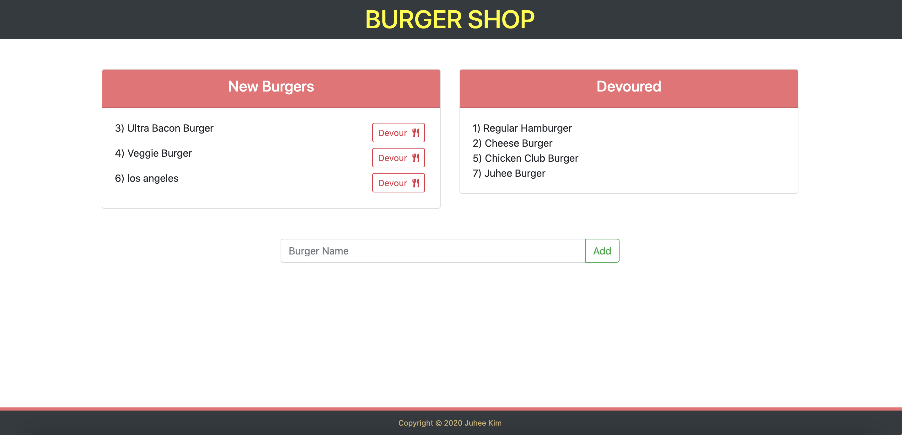

# Restaurant App - BURGER SHOP
A restaurant app that lets users input the names of burgers they'd like to eat. Whenever the user submits a burger's name, the app will display the burger on the left side of the page. Each burger in the waiting area also has a `Devour it!` button. When the user clicks it, the burger will move to the right side of the page.

## Link
Please visit [Restaurant-App](https://sleepy-castle-85149.herokuapp.com/) site!

## Screenshots

## Built with
- [HTML](https://developer.mozilla.org/en-US/docs/Web/HTML)
- [CSS](https://developer.mozilla.org/en-US/docs/Web/CSS)
- [Bootstrap](https://getbootstrap.com/)
- [Google Fonts](https://fonts.google.com/)
- [jQuery](https://api.jquery.com/)
- [node.js](https://nodejs.org/en/)
- [Handlebars](https://handlebarsjs.com/)
- [Heroku](https://www.heroku.com/)

